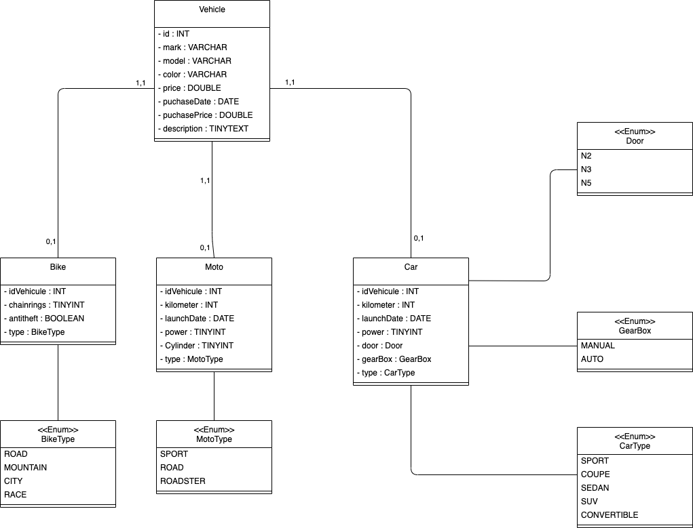

# PROJET CONFIGURATEUR DE VEHICULE

## Contexte du projet

Votre employeur a été engagé par BestDeals Ltd, société basée aux États-Unis.  
Ils souhaitent lancer une plateforme de revente en ligne de véhicules d'occasion qu'ils achètent aux enchères.
Dans un premier temps, ils vont vendre des vélos, des motos, des scooters, et des voitures. Ils se réservent la possibilité à l'avenir de vendre des camions, des bateaux, des drones, des avions, la seule limite étant leur imagination. 
​ 
Votre manager a décidé de vous confier le développement du prototype du formulaire de saisie de véhicule, qui sera accessible dans le panneau d'administration du site. 
Vous avez une semaine pour présenter un prototype fonctionnel au client. Vous devez donc créer trois pages webs :
  * une page avec la liste des véhicules enregistrés dansla base de données
  * une page avec la fiche d'un véhicule
  * le plus important, un formulaire permettant la saisie d'un nouveau véhicule​

Le formulaire doit permettre de choisir le type de véhicule, puis de saisir les informations correspondantes (marque, couleur, date d'achat, prix d'achat, prix de revente HT, et toutes les informations classiques pour chaque type de véhicule).​ 
​ 
Les trois pages doivent être fonctionnelles (pas forcément jolies). Le formulaire doit permettre d'ajouter un vélo, une moto, ou une voiture au choix. Les éléments communs aux trois véhicules, ainsi que 2 ou 3 éléments spécifiques à chacun d'entre eux doivent être présents.​ 
Par exemple : on doit pouvoir saisir la marque, la date d'acquisition, la couleur, et le prix de vente de chacun des véhicules. Pour les vélos, on va ajouter le type de vélo (route, VTT, etc), le nombre de plateaux, s'il y a un marquage anti-vol ou pas. Pour les véhicules à moteur, le kilométrage et la date de première mise en circulation. Pour les voitures, on va indiquer le type, le nombre de portes, si la boîte de vitesse est mécanique ou automatique, et la puissance en chevaux. Pour les motos, la cylindrée, la puissance, et le type.​ 
Attention, le formulaire ne doit suggérer que les valeurs cohérentes avec le véhicule choisi.​ 
​ 
Le client étant une société américaine, votre code et l'interface Front doivent être rédigés en anglais. Pour le Readme, l'anglais est un bonus, mais vous pouvez le rédiger en français si vous estimez que vos explications seront plus claires en français.

## Installation

* Modifier les propriétés de la base de données dans le fichier `application.properties`
* lancer spring boot - la base se créée automatiquement
* faire un `npm install` depuis "front/configurateur-De-Vehicule" puis `ng serve`
* Dans le header de la page web faire "init-database"

## Fonctionnalités

* visualiser la liste de tous les vehicules
* visualiser toutes les inforamtions d'un vehicule
* editer un vehicule
* supprimer un vehicule
* ajouter un nouveau vehicule

## Modele de donnees

## Diagramme de classe

## Utilisation des design pattern

### DTO Pattern

J'utilise le pattern DTO pour transmettre les entités de la base de données vers le front :
* L'un des DTO comprend les attributs minimum pour afficher la liste de tous les vehicules et donc économiser le débit de transfert
* Le second DTO contient toutes les données additionnées de chaque vehicule pour ne transmettre qu'un seul objet que se soit une moto, une voiture ou un vélo. (en get ou en post)

### Builder Pattern

Le builder pattern va permettre de créer les entités à persister en bdd depuis les DTO remontés du front en fonction du type de vehicule pour récupérer seulement les éléments vouluent.
Il va aussi permettre de créer des entités custom pour des tests par exemple.
Le builder est créé en InnerClass dans les entités, tous les builders sont des attributs optionnels, les attributs obligatoires sont dans le constructeur avec une verification non null.

### Factory pattern

J'utilise le pattern factory dans la class `vehicleFactory` pour initialiser le bon repository et récupérer l'entité à renvoyer au front et visualiser la totalité des infos de l'élément (Cette methode sert seulement pour l'exercice, le vehicleRepository parent le fait déjà automatiquement...)

### Method Factory Pattern

Utilisation du Factory methode dans le package `entityBuilder` pour créer la bonne entité vehicle depuis un DTO et le sauvegarder dans la bdd.

### Proxy pattern

Utilisation du pattern proxy  avec l'annotation `@Lazy` dans la class `vehicleFactory` pour instancier les repository seulement s'ils ont besoin d'être utilisé

## Auteur

Roland FOUCHER

